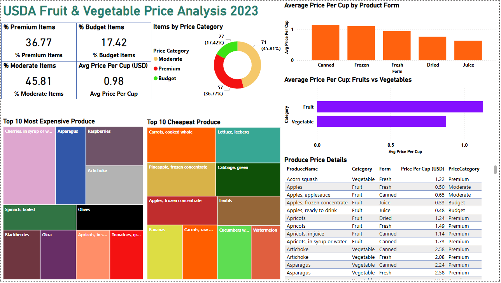

# PowerBI-Dashboard
USDA Fruit &amp; Vegetable Price Analysis Dashboard

---

## Dashboard Preview

  

---

## Project Overview
An interactive Power BI dashboard analysing average retail prices for 155 commonly consumed fruits and vegetables across the United States, using 2023 data published by the USDA Economic Research Service (ERS).

---

## Dataset
| Field | Details |
|---|---|
| Source | [USDA ERS — data.gov](https://catalog.data.gov/dataset/fruit-and-vegetable-prices) |
| Files | fruit-prices-2023.csv, vegetable-prices-2023.csv |
| Records | 155 produce items (62 fruits, 93 vegetables) |
| Time Period | 2023 |

---

## 🔧 Tools & Features
- **Tool:** Microsoft Power BI Desktop
- **Data Cleaning:** Power Query Editor
- **DAX Measures:** 4 custom measures
- **Calculated Column:** PriceCategory (Budget / Moderate / Premium)
- **Visuals:** 10 visuals including treemaps, cards, bar/column charts, donut chart and detail table

